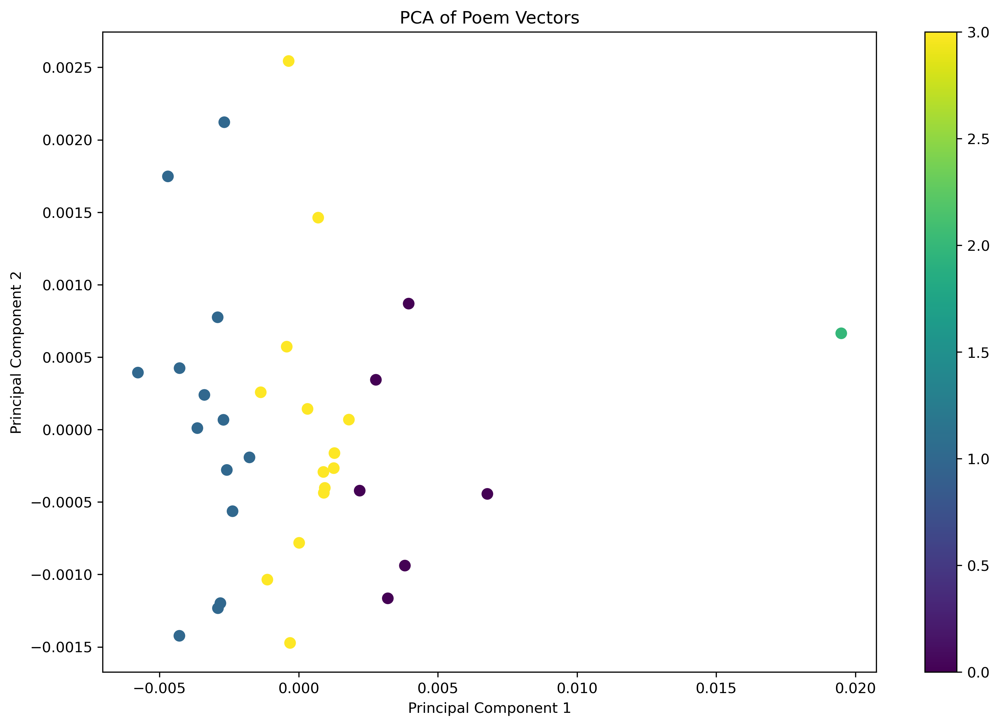

# Clustering Laxmi Prasad Devkota's Poems

## Introduction


Laxmi Prasad Devkota (1909-1959), known as Nepal's "Maha Kavi" (Great Poet), stands as a towering figure in Nepali literature. A pioneer of neo-romantic poetry, his work blends lyrical elegance with deep philosophical undertones. Through masterpieces like "Muna Madan," Devkota captures the essence of human experience, particularly the trials, tribulations, and emotions of everyday people. His legacy continues to shape and inspire contemporary Nepali literature.

## Project Objectives

This project seeks to categorize 36 of Devkota’s translated poems into four thematic clusters:

- **Nature**
- **Society**
- **Culture**
- **Spirituality**

The poems have been sourced from WikiSource and translated into English for this study.

## Workflow and Approach

### Project Workflow

The process of clustering the poems can be visualized in the following workflow:

1. **Data Collection:** Aggregating Devkota’s poems from credible sources.
2. **Data Preprocessing:** Cleaning the text by removing stop words, numbers, and symbols; translating them to English; and applying tokenization and lemmatization.
3. **Feature Extraction:** Leveraging NLP techniques such as Word2Vec for embedding the poems into high-dimensional vectors.
4. **Clustering:** Implementing unsupervised learning models to cluster poems based on thematic similarity.


_Figure 1: Process Workflow_

### Dimensionality Reduction and Visualization

To visualize the high-dimensional data, PCA (Principal Component Analysis) is used for dimensionality reduction, making it easier to interpret the clustering results.


_Figure 2: PCA Visualization_

## How to Run This Project

### Prerequisites

1. Python 3.x
2. Required libraries:
   - `numpy`
   - `pandas`
   - `matplotlib`
   - `nltk`
   - `gensim`
   - `scikit-learn`

### Installation

First, clone the repository:

```bash
git clone https://github.com/yourusername/devkota-poem-clustering.git
cd devkota-poem-clustering
```
