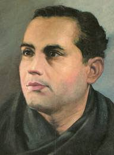
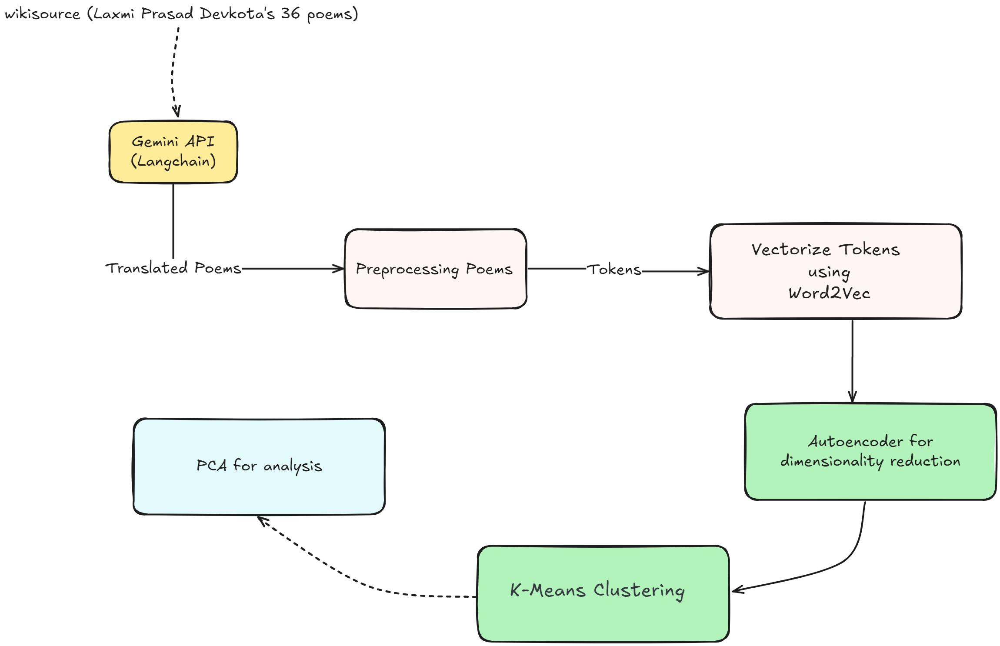
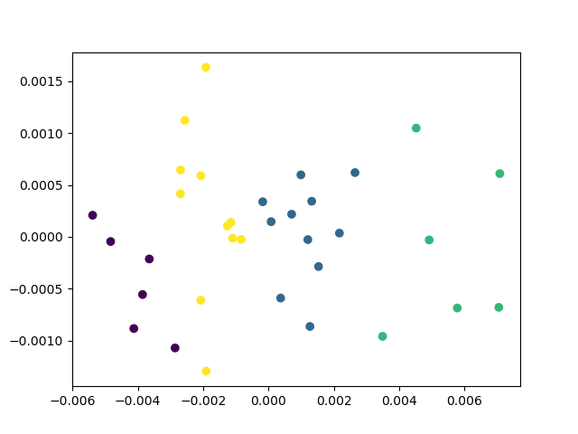
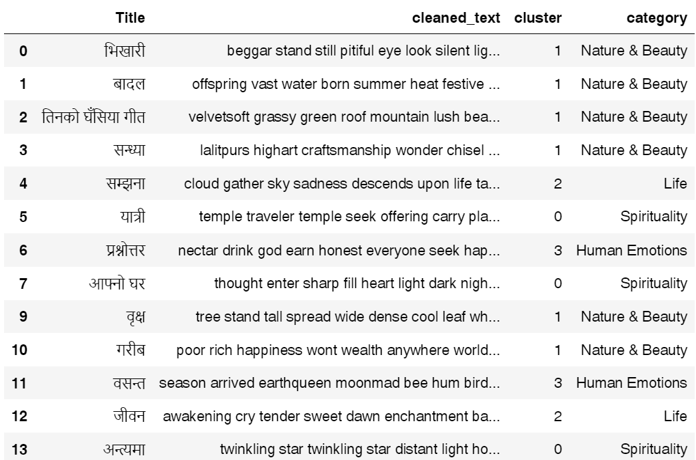

# NLP-Based Analysis of Laxmi Prasad Devkota's Poetry

## Overview

This project applies Natural Language Processing (NLP) techniques to analyze and categorize the poems of Laxmi Prasad Devkota, a renowned Nepali poet. We aim to cluster 35 of Devkota's translated poems into four thematic categories using advanced machine learning algorithms.



## About Laxmi Prasad Devkota

Laxmi Prasad Devkota (1909-1959), revered as Nepal's "Maha Kavi" (Great Poet), was a pioneering figure in Nepali literature. His neo-romantic poetry, exemplified by works like "Muna Madan," seamlessly blends lyrical beauty with profound philosophical insights, capturing the essence of human experience and the spirit of everyday people.

## Project Objectives

Our goal is to categorize Devkota's poems into four thematic clusters:

1. Nature & Beauty
2. Society
3. Culture
4. Spirituality

We've sourced 36 poems from WikiSource and translated them into English for this analysis.

## Methodology

### Workflow

Our analysis follows this structured approach:

1. **Data Collection**: Aggregating poems from WikiSource
2. **Preprocessing**: Cleaning, translating, and preparing text data
3. **Feature Extraction**: Employing Word2Vec for text embedding
4. **Clustering**: Implementing K-means algorithm for thematic grouping



## Getting Started

### Prerequisites

- Python 3.7+
- pip

### Installation

1. Clone the repository:

   ```bash
   git clone https://github.com/yourusername/devkota-poem-clustering.git
   cd devkota-poem-clustering
   ```

2. Install Dependencies:

   ```bash
    pip install -r requirements.txt
   ```

### Usage

1. Get your Gemini API Key (if you want to use from scratch)

2. Scrape poems:

   ```bash
    python web-scrap.py
   ```

3. Translate poems:

   ```bash
   python translate_poems.py
   ```

4. For preprocessing and feature extraction, use the provided Jupyter Notebook.

## Results

## Dimensionality Reduction Visualization

We use Principal Component Analysis (PCA) to visualize our high-dimensional data:



## Poem Categorization

Our clustering results:



## Contributing

We welcome contributions to enhance this project! Whether you have ideas for improving clustering algorithms, refining preprocessing steps, or introducing new visualization techniques, please feel free to submit a pull request.

## Issues

If you encounter any problems or have suggestions, please open an issue in the GitHub repository.
License
This project is licensed under the MIT License.

## Acknowledgments

- Laxmi Prasad Devkota Foundation for preserving the poet's works
- WikiSource contributors for digitizing Devkota's poems
- The open-source NLP community for their invaluable tools and resources
